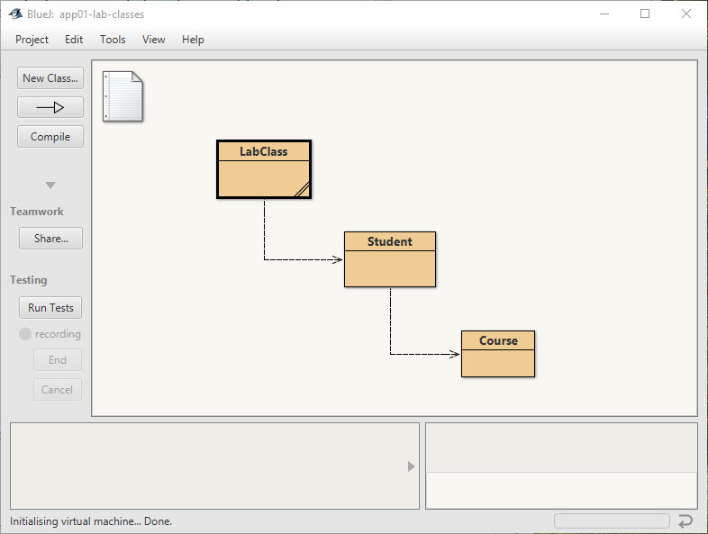

# App21-01 Student Enrolments

## Description
This app is modelled on the way BNU (Bucks New University) works, and this is similar to most universities in the uk.      
See [BSc Awards](https://github.com/BNU-CO452/BlueJ-Apps/wiki/BSc-Awards)

A Student can enrol on a Course.  The Course class stores the course code and the title of the course, and the Student class stores the students ID and name.  Java code already exists for most of the features. but this code must be tested.

Codes or IDs are commonly used whenever you have many items (students, courses, modules) which might have similar or identical names.  They are an essential part of the way relational database work.  They have to be unique values, and ideally should be easy to recognise.
## Testing Requirements Stage 1
Document your testing by selecting **View ->  Show Terminal** in BlueJ and then Select **Options -> Record Method Calls**.  When the testing is complete save to a **txt** file as **"Tests01.txt"** in your App-211 folder. Ensure that **Clear screen at method call** is off.
1. Create a new Course object called **"computing"** for example
2. Set the BNU Course **code** (see below) and the course **title** to your own course title for example "BSc Computing".
3. Print the **course** details. 
4. Create a new student object with your **name** and your student **id**.
5. Print out the details the student object. 
6. Enrol the student on the Course.
7. Print out the details of the student's course
8. Screen shot your object bench at the end of testing and save the file in your app211-enrolments folder.
9. Save your terminal window output to a **txt** file as **"Tests01.txt"** in your App-211 folder. 

| Course Code | Course Title |
|:------------|:-------------|
| BT1CTG1 | BSc Computing |
| BT1CWD1 | BSc Computing & Web |
| MT1CYS1 | BSc Cyber Security |
| BT1GDV1 | BSc Games Development |
| BT1IGP1 | BSc Games Production |
| BB1ARI1 | BSc Artificial Intelligence |
| BT1SFT1 | BSc Software Engineering |
| BB1DSC1 | BSc Data Science |
| BB1BMI1 | BSc Business Management and Information Technology |

*To be replaced by students own screen shot*   

    

*To be replaced by a link to the students own text file*  

[Tests Stage 1](https://github.com/BNU-CO452-Derek/BlueJ-Apps21/blob/main/app211-enrollments/Tests01.txt)

## New Requirements
1. A new class called Module and create a suitable constructor
2. Variables for the code, title and credit value for a Module
3. Methods to get the value of those variables
4. A method to set a value for the module's credit.
4. A method to print all the details of a module.
5. A new variable so that a course can contain one module
6. A method in the course class to add a module to a course.
7. A modified Course print method that prints the details of the course and the module

### Testing Requirements Stage 2
1. Create a new module with code "**CO452**" and title "**Programming Concepts**"
3. Print out the details of this module (credit should be 0)
2. Set the credit for this module to **15**
3. Print out the details of this module again
4. Print out the course's module details (exception thrown!)
5. Add this module as part of the course
6. Print out the details of the course's module

### Student Testing

*To be replaced by students own screen shot including the students own details*   

    

*To be replaced by links to the students own text files*        

[Tests Stage 1](https://github.com/BNU-CO452-Derek/BlueJ-Apps21/blob/main/app211-enrollments/Tests02.txt)
[Tests Stage 2](https://github.com/BNU-CO452-Derek/BlueJ-Apps21/blob/main/app211-enrollments/Tests02.txt)

## BlueJ UML Design

This is produced using the BlueJ extension called UML Class Icons just to show the difference between a full UML class diagram and the simple class diagram produced by BlueJ.
    
[How to Install BlueJ Extensions ](https://github.com/BNU-CO452/BlueJ-Apps/wiki/BlueJ-Extensions)

## Example Evaluation
*Usually completed by the student*
1. A course does not contain a list of students
2. Course can only access a single Module
3. There is no user interface and the program can only be used in BlueJ
4. There is no connection between a Student and a Module
5. No information can be stored on a students grades or marks
